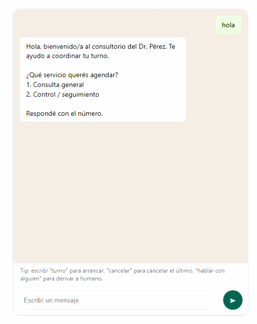

**Read this in [English](READMEenglish.md).**

# Turnero Bot

**Bot de agendamiento de turnos por chat, configurable por negocio y agnóstico al canal.** Un negocio (peluquería, consultorio, gimnasio) define su configuración en un archivo y obtiene un asistente que coordina turnos con sus clientes en una conversación tipo WhatsApp.


> **Estado:** MVP funcional. El motor de conversación está terminado y probado de punta a punta; el conector de WhatsApp es el próximo paso (ver [Roadmap](#roadmap)).

## El problema

Muchos negocios chicos coordinan turnos a mano por WhatsApp: el cliente escribe, alguien tiene que contestar, revisar la agenda, proponer horarios y anotar. Es lento, interrumpe el trabajo y se presta a errores (turnos pisados, olvidos). Este bot automatiza esa conversación completa.

## Demo



El proyecto incluye una interfaz de chat web que simula WhatsApp, para poder probar toda la lógica sin depender de la API de Meta.

## Cómo probarlo

```bash
npm install
npm start
```

Abrí `http://localhost:3000` y chateá con el bot como si fuera WhatsApp. Arriba a la derecha se puede cambiar entre los negocios de ejemplo (peluquería / consultorio) para ver cómo el mismo motor se comporta distinto con solo cambiar el archivo de config.

Palabras clave que el bot entiende en cualquier momento de la charla:

- `turno` → inicia el flujo de reserva
- `cancelar` → cancela el último turno confirmado
- `hablar con alguien` → deriva a una persona

## Cómo funciona por dentro

Cada conversación es una **máquina de estados**. El bot lleva al cliente por pasos ordenados —elegir servicio → elegir día → elegir horario → dar el nombre → confirmar— y en cada mensaje entrante:

1. Carga en qué paso está ese cliente (el estado se guarda en SQLite, así sobrevive entre mensajes).
2. Valida la respuesta; si no es válida, vuelve a preguntar.
3. Guarda la elección y avanza al paso siguiente.
4. Devuelve el próximo mensaje del bot.

**Decisión de diseño central: el motor no sabe nada de WhatsApp.** La función `processMessage(negocio, idCliente, nombre, texto)` recibe texto y devuelve texto — nada más. El canal (chat web hoy, WhatsApp mañana) es intercambiable sin tocar la lógica. Esto permite desarrollar y testear todo el flujo desde el día uno, sin esperar la verificación de un número en Meta, que puede llevar días.

## Estructura

```
turnero-bot/
├── server.js                   # servidor Express, expone /api/chat
├── config/businesses/          # un .json por negocio = la configuración del bot
├── src/engine/
│   ├── conversationEngine.js   # la máquina de estados: qué se pregunta y en qué orden
│   └── scheduler.js            # calcula horarios libres, guarda y cancela turnos
├── src/db/db.js                # persistencia en SQLite (módulo nativo de Node)
└── public/index.html           # chat de prueba en el navegador (simula WhatsApp)
```

## Configurar un negocio nuevo

No hace falta tocar código: se copia un archivo de `config/businesses/`, se le pone un `businessId` único y se ajustan:

- `services` — servicios ofrecidos y su duración en minutos
- `workingHours` — horario por día (`null` = cerrado ese día)
- `slotMinutes` — cada cuánto se puede sacar turno
- los textos (`welcomeMessage`, `confirmationMessage`)

Esa separación entre datos (config) y lógica (motor) es lo que permite sumar un cliente nuevo en minutos.

## Stack

- **Node.js + Express** — servidor y endpoint HTTP
- **SQLite** (módulo nativo de Node) — persistencia sin un servidor de base de datos aparte
- **HTML / CSS / JS** vanilla — interfaz de prueba

## Roadmap

- [ ] **Conector de WhatsApp** vía WhatsApp Cloud API (Meta): un webhook que reciba los mensajes entrantes y llame a `processMessage(...)`, con el servidor deployado en Railway o Render.
- [ ] **Panel para el dueño del negocio** — vista web con los turnos del día / la semana.
- [ ] **Recordatorios automáticos** — mensaje el día previo al turno para reducir ausencias.
- [ ] **Parsing flexible de fecha/hora** — entender "mañana a las 4", no solo el número de opción.
